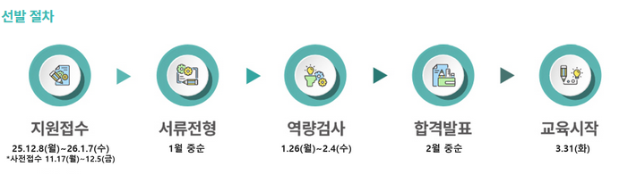
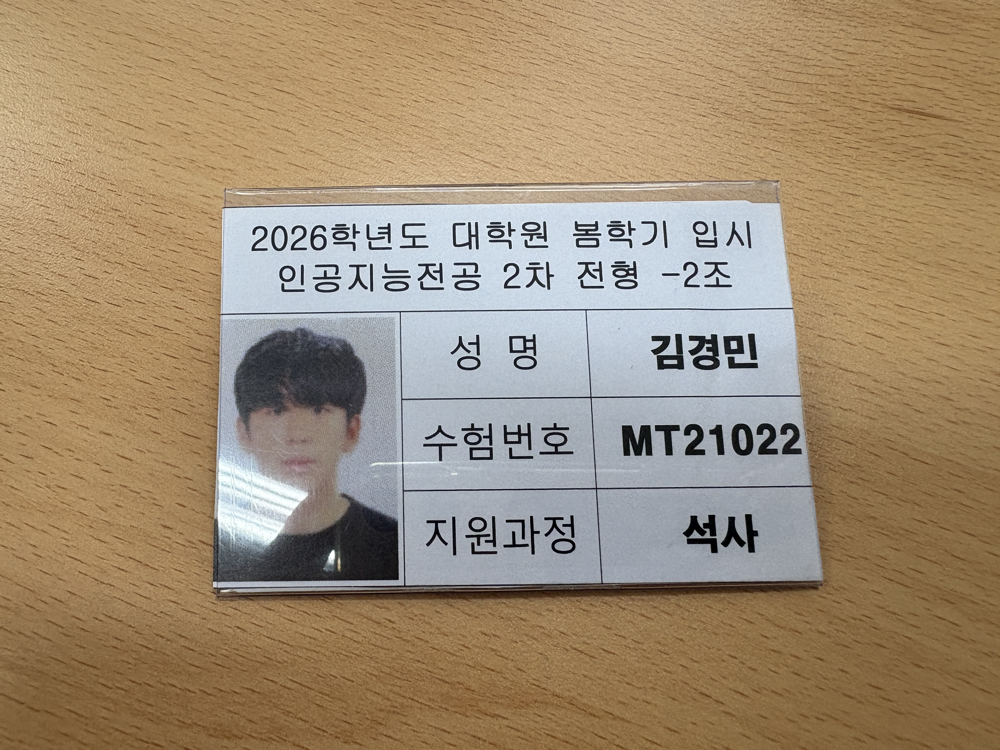

## 들어가며
Velog에서 마지막글을 작성했던 2025년 6월 기점으로 약 10개월이 지나갔다. (옵시디언, 노션으로 기록을 했기 떄문에 밀렸던게 당연한가..) 그시간동안 많이 도전하고 실패도 느껴봤던거 같다. 졸업하기전 내가 원하던 목적지에 최종 도달하는데 실패했지만 하나씩 나의 기억을 정리하며 이제부터 다시 Velog로 돌아와  기록하고자 한다.

---
## 2025년 마지막 여름 방학
| 정말 | 감사했습니다! |
| :---: | :---: |
|  |  |

2025년에 여름방학은 나의 본가인 부천에서 보내지 않고 학교 연구실에 출근해 9 to 6을 지키려고 노력했다. 교수님이 방학 동안은 학부수업이 없으니 훨씬 여유롭고 자신이 집중하면 연구, 개인공부 등 하고싶은 공부를 하면 모든 것을 이뤄낼 수 있다고 응원도 해주셨다. (연구실에 있는 학부연구생, 석사생분들) 모든 사람들이 같이 학습하고 회의할 수 있는 장을 보낼 수 있게 RAG, LLM 공부 회의 및 논문세미나를 진행해 혼자 학습만을 하는 것이 아닌 함께 학습할 수 있어 보다 수 훨씬 하게 공부할 수 있었던 거 같다. 

| | |
| :---: | :---: |
|  |  |

---

방학 동안에 있던 가장 뜻깊은 경험이라면 내가 너무 감사하게도 학교 등록금을 전액 받으면서 다닐 수 있었던 KT 디지털 인재 장학생으로써  KT 직원들과의 팀 프로젝트가 있었다. 조원은 학생들끼리만 배정되고 피드백을 각 독방에 멘토님이 계셔서 우리가 궁금한 점 어떤 점이 부족한가에 대한 가차없는 피드백을 받을 수 있었다. 우리 조는 총 4명으로 내가 조장으로써 좋은 성과를 내기위해 열심히 노려했던거 같다. [Notion-Team Project - 11](https://github.com/KT-TeamProject-11) 천안재생센터와 미팅을 진행하며 요구사항을 듣고 우리가 천안재생센터가 필요하다고 생각하는 웹 또는 앱에 대한 주제를 선정해 결과물을 만들어 1박 2일 워크숍도 잘 다녀왔다. 내가 대학생인 신분에서 쉽게 경험하지 못할 이 감정을 선물해주신 KT-SEG 경영팀, 임직원분들, 그리고 멘토로 활동해주신 KT-Model Prototype, LLM, Cloud팀 멘토님들에게 감사인사를 전합니다.

&gt;#### 추가로
+  정보통신산업진흥원이 운영하는 2025-오픈소스 컨트리뷰션 아카데미 [Pytorch 문서화 번역] 파트 멘티에 참여하게 되어 2학기에 진행할 예정이다.
- 빅데이터분석기사 실기에 합격해 자격증 +1 
- KT-AI 생성형AI 영상부문 공모전 입상 +1
- 백준 골드5 달성 

---
## 2025년 마지막 학기를 보내며
대학교 4-2학기인 마지막 학년을 보내며 주위친구들 중 이제 자리를 잡아가는 친구들도 하나둘씩 생기게 되었다. 대기업, 여러 인턴을 도전하는 친구들, 전공을 포기하고 다른 일자리를 찾으며 공인어학성적을 준비하는 친구들 중견, 중소에 취업해 졸업 전에 자기의 뜻을 이룬 친구들 등 나도 나 자신이 노력하고 있다고 생각하고 하루를 뜻깊게 살았지만 나보다 더 노력하고 열심히 하는 주위친구들이 많았었다고 생각한다. 나의 마지막 학기에 끝은 학부연구생을 하며 좋아하던 연구가 생겼었고 그 분야에 도전하기 위해 ist계열 대학원에 지원했었다. (서울권 대학원은 아무리 그래도 등록금에 대해 너무 부담스럽다고 생각했다.)

| 면접 |  [졸업작품](https://github.com/KKU-NoteFlow) |
| :---: | :---: |
|  |  |

(디지스트, 지스트, 유니스트)과학기술원에 도전하였고 지스트는 서류가 떨어졌지만 유니스트와 디지스트는 서류에 합격해 면접을 볼 좋은 기회가 생겼었다. 각 대구와 울산에 있으며 나의 학교인 충주에서 출발해도 하루를 학교 공결내고 왕복해도 부족할 만큼 거리가 좀 멀었던 기억이 남는다. 두 가지의 면접 모두 제공해준 지침과 구글링을 통해 어느 정도 감을 잡고 있었지만, 영어로 발표와 대답을 할 수 있다는 점이 나에게는 큰 한계였던 거 같다. 내 나름대로 짧은 기간 동안 모든 심혈을 기울여 집중하고 밤새고 대본 외우고 학교, 집에서 PT 연습을 많이 했었지만, 결과는 둘 다 떨어졌다. (교수님 컨택이 늦은 점도 있으며 면접 당시 1지망에 지원했던 교수님에게만 메일이 오지 않았지만, 면접에서 1지망 교수님이 있어서 매우 당황했던 기억이 있다.) 떨어지고 나서 미리 완성했었던 [졸업작품](https://github.com/KKU-NoteFlow) 발표도 전시회도 그럭저럭 마무리하며 내가 2년 동안 함께했던 컴퓨터공학과 학생회 사람들과 나의 학교생활을 마무리했던 거 같다. (학부연구생 연구 할당에 집중하지 못한 내가 아쉽네..)

&gt; #### 추가로
- 정보처리기사 합격으로 자격증 +1 
- 학교 내 Mircro_Degreee - 인공지능전문가양성과정 수료
- OSSCA-오픈소스-Pytorch 멘티 활동 수료
- AI-FSESTA 컨퍼런스 참여
&gt;- 2025 GIT

---

## 2026
| 사진이 많아서..  | 생략해서 미안 |
| :---: | :---: |
|   |  |

졸업식, 연구실정리, 부트캠프, 다시 대학원 컨택 등 내가 앞으로 나가아갈 내 자신이 두려웠다. 사실 대학원에 떨어졌던 충격이 제일 크기도 했지만 내가 제일 잘하는 것이 무엇일까, 내가 노력했던 분야를 끝까지 물고가면 성공, 합격할 수 있을까 생각했다. 종강하고 3년동안 머물렀던 자취방을나와 오랜만에 나의 본가에 도착했다. 그동안 밀렸던 잠도 자고 국외여행도 (일본, 베트남) 다녀왔다. 졸업이기에 급한 마음도 있었지만 다시 오지 않을 26살이자 회사 또는 다른 일을 시작하게 된다면 이럴 시간도 없을 것이라 생각했다. 놀기도 놀지만 매일 코딩테스트 문제나 내가 관심 있었던 머신 러닝, computer vision, 3D 그래픽 기사나 책도 가끔 읽는다. 이건 순순히 재밌기도 했고 밤새우면서 내가 무엇 가에 오랫동안 몰두했던 기억이 남아서이기도 한 거 같다. 하루를 낭비하지 않고 살아가는 것 그렇게 살기 위해 오늘 다시 시작해보려고 한다.
&gt;포기하지말자

